# taskflow-gitops — dépôt GitOps du cours CI/CD M2

Ce dépôt décrit **l'état voulu** de l'application TaskFlow dans Kubernetes.
Argo CD le surveille et aligne le cluster dessus : pour changer la production,
on ne tape pas de commande, on fait une **Pull Request**.

## Installation (à faire chez vous, avant le cours)

Prérequis : Docker Desktop démarré, 8 Go de RAM, 10 Go de disque libre.
Sous Windows : WSL2 (Ubuntu) + intégration WSL de Docker Desktop, et toutes les commandes dans WSL.

```bash
git clone https://github.com/9m7fjfpv9k-cyber/taskflow-gitops.git
cd taskflow-gitops
./scripts/install.sh
```

Le script crée un cluster local `kind`, installe Argo CD et Argo Rollouts,
puis télécharge les images des labs. Comptez 5 à 15 minutes.
Il peut être relancé sans risque.

## Structure

| Chemin | Rôle |
| --- | --- |
| `apps/taskflow/` | Les manifests surveillés par Argo CD |
| `argocd/application.yaml` | Déclare l'application dans Argo CD |
| `exemples/bluegreen/` | Manifests pour le déploiement Blue-Green |
| `exemples/canary/` | Manifests pour le déploiement Canary |
| `scripts/install.sh` | Installation de l'environnement |
| `scripts/argocd-ui.sh` | Ouvre l'interface d'Argo CD |
| `scripts/observe.sh` | Montre quelle version répond, et avec quel code HTTP |

## Images disponibles

`ghcr.io/9m7fjfpv9k-cyber/taskflow` en versions `1.0.0`, `1.1.0`, `2.0.0` et `2.1.0`.

## Équipe

Elias 

## Captures

### Dernière PR et déploiement

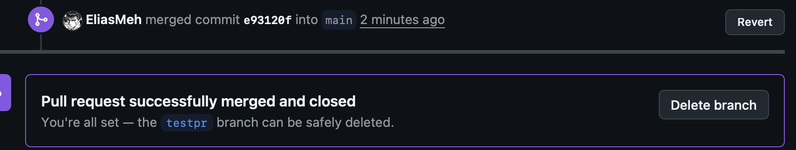

La capture montre la date du dernier merge de la PR, et le déploiement a été appliqué par Argo CD en moins d’une minute.

### Dernière synchronisation Argo CD

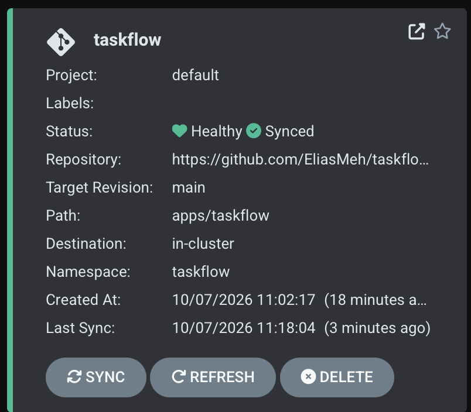

La capture montre la date et les minutes de la dernière synchronisation Argo CD, avec le projet `taskflow` en état `Synced` et `Healthy`.

### Vérification du namespace `taskflow`

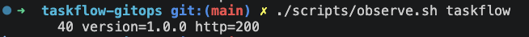

Cette capture illustre le résultat du script `./scripts/observe.sh` : le namespace `taskflow` existe bien et le service répond correctement.

### Dérive manuelle corrigée immédiatement


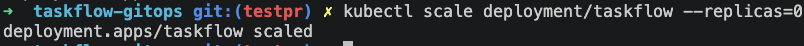

Lorsqu’on exécute une commande telle que `kubectl scale deployment/taskflow --replicas=0`, le cluster diverge de l’état décrit dans Git. Argo CD le détecte immédiatement et réapplique automatiquement la configuration voulue, de sorte que la version de base est restaurée quasi instantanément. C’est le principe du GitOps : Git reste la source de vérité, et Argo CD corrige automatiquement les écarts du cluster.

### Temps de synchronisation Argo CD

Le déploiement n’est pas instantané à l’instant précis du merge : Argo CD applique les changements au prochain cycle de reconciliation. Dans ce projet, la fréquence a été configurée à 60 secondes via la configuration de Argo CD, ce qui explique pourquoi le passage d’une version à l’autre a pris environ une minute. La synchronisation est donc dépendante du polling Argo CD et du temps de comparaison entre l’état Git et l’état réel du cluster.

### Revert de la PR et retour à la version précédente

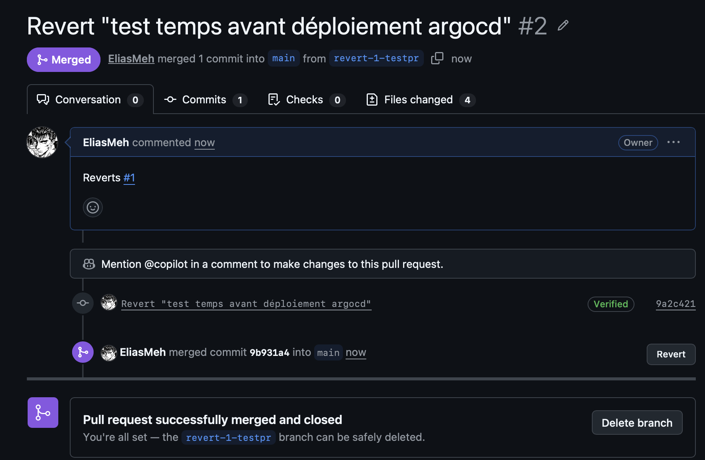

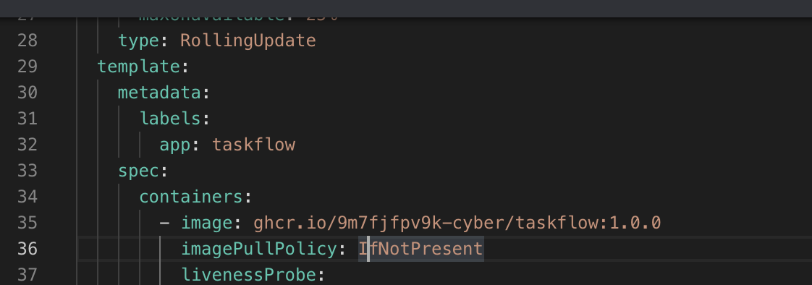

Après avoir effectué le revert de la PR, le déploiement est immédiatement ramené à sa version précédente. La transition de `2.0.0` vers `1.0.0` est ainsi rétablie presque instantanément par Argo CD, ce qui confirme que la branche Git reste la source de vérité et que le cluster suit automatiquement l’état voulu.

### Prune après suppression du fichier `service.yaml`

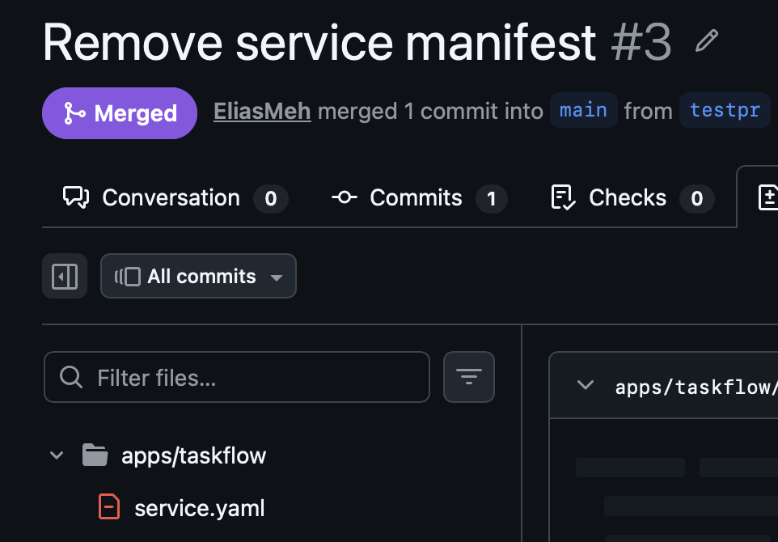

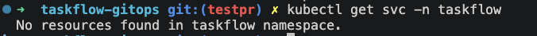

Après avoir supprimé le fichier `service.yaml` dans la PR, Argo CD a appliqué automatiquement le prune. Le `Service` n’apparaît plus dans le namespace `taskflow`, ce qui montre que les ressources absentes du dépôt Git sont supprimées du cluster par Argo CD. C’est le comportement attendu du mode `prune: true` dans le GitOps.

# LAB Blue-Green Canary

## Blue Green Part


### Changement de version dans le code

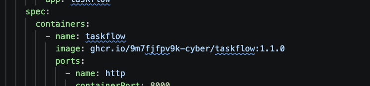

Le manifeste a été modifié pour faire passer l’image de la version actuelle vers une version cible, en gardant le principe GitOps : le dépôt reste la source de vérité.

### Présence du système Green et du système Blue

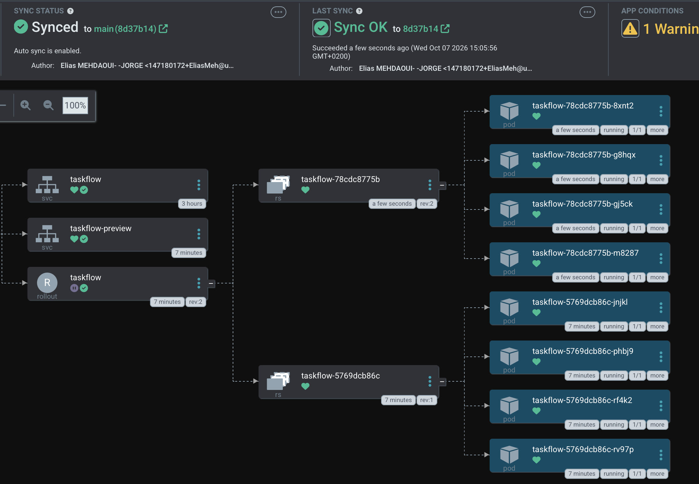

Dans une stratégie Blue-Green, le système actif et le système de prévisualisation coexistent pendant la validation. Le trafic reste sur le service actif jusqu’à la promotion.

J'ai oublié de modif le observe.sh histoire de voir tous les pods mais en soit la vue IHM revient au même.

### Pré-promotion : sortie du script `observe.sh`

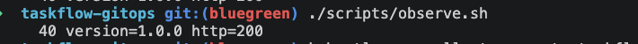

Avant la promotion, le script `observe.sh` montre encore la version active en circulation. On voit que le service répond encore avec la version précédente, ce qui confirme que le trafic n’a pas encore été basculé.

### Commande de promotion utilisée

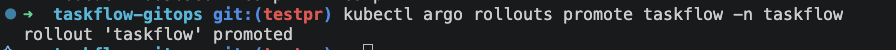

```bash
kubectl argo rollouts promote taskflow -n taskflow
```

Cette commande a été utilisée pour promouvoir la version prête vers le service actif.

### Post-migration : sortie du script `observe.sh`

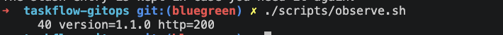

Après la promotion, le trafic est maintenant servi par la nouvelle version. La sortie montre la réponse du service après le basculement, ce qui valide que la migration est effective.

### Passage effectif vers la nouvelle version

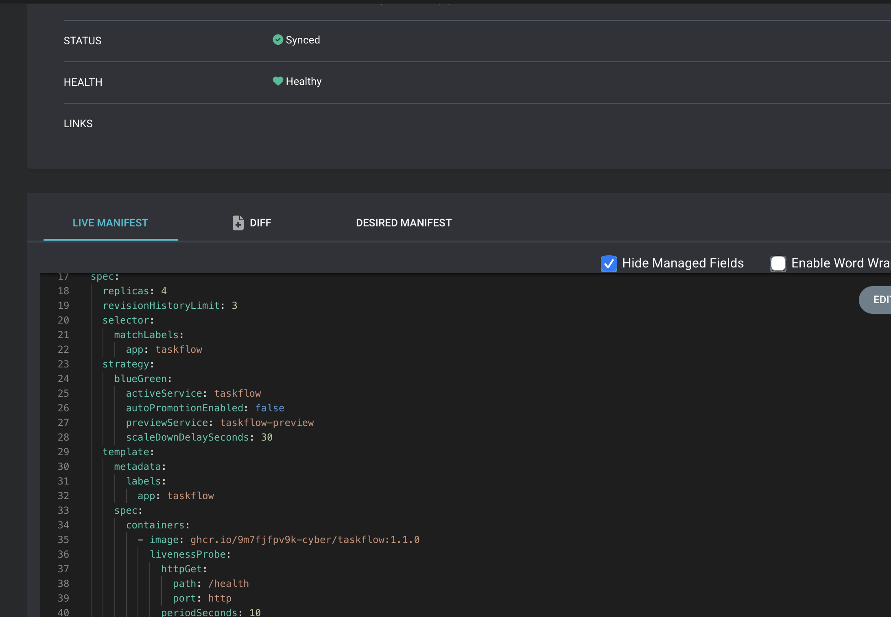

Après promotion, la nouvelle version est activée et on peut le vérifier dans le manifeste : la version de travail et la cible sont bien visibles dans la configuration; la bascule est maintenant effective.

## Canary Part

### Remplacement du `Deployment` par un `Rollout` Canary

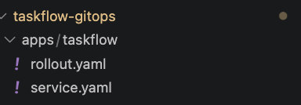

Le manifest de déploiement est remplacé par un `Rollout` afin d’autoriser les étapes de promotion progressive, le traffic split et la gestion de la fenêtre de validation avant basculement complet.

### PR sur la version `1.1.0`

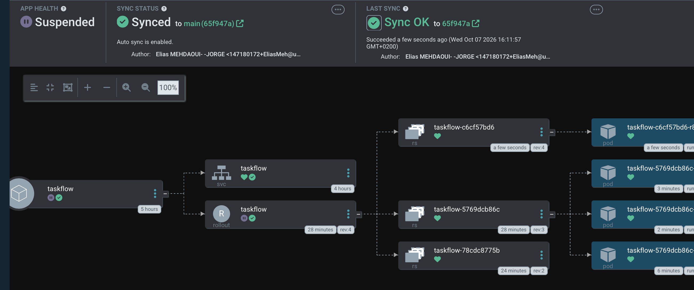

La PR met à jour l’image vers `1.1.0`. Argo CD synchronise l’application et confirme le bon état global du cluster : le dépôt reste la source de vérité et le cluster est aligné dessus.

### Canary en pause avant promotion

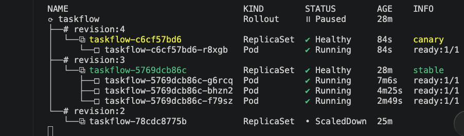

Le rollout est mis en pause pendant la validation. On observe que la nouvelle révision est présente, mais que le trafic n’est pas encore complètement basculé vers elle et que les anciennes révisions restent encore stables.

### Promotion partielle du canary

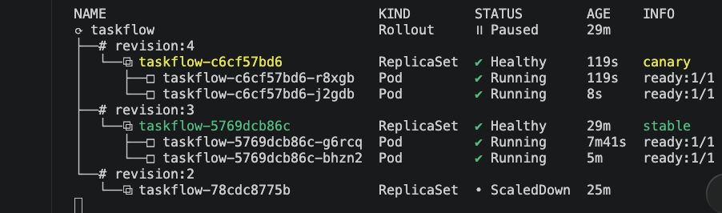

La promotion avance progressivement. Les anciennes et nouvelles révisions coexistent temporairement, et le système répartit le trafic de manière contrôlée au lieu d’un basculement brutal.

### Promotion jusqu’à 100 %

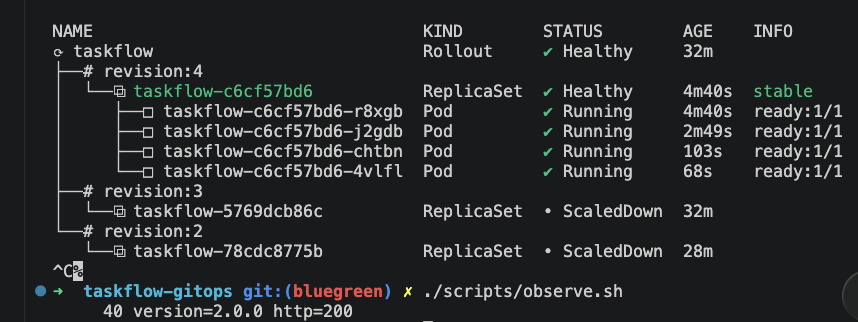

La nouvelle version devient stable après validation. Les anciennes révisions sont alors mises à l’échelle vers zéro et le rollout est considéré comme healthy.

### Abort du canary : l’état passe en `Degraded`

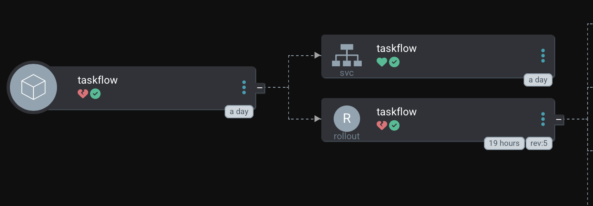

Lorsqu’une nouvelle version ne respecte pas les critères de qualité attendus, l’abort du canary permet de revenir immédiatement à un état stable. La sortie montre bien le passage en état `Degraded` et confirme que le système a été ramené à un niveau de service sûr avant de poursuivre ou de corriger la version.

### Tentative de passage en 2.1.0 et Vérification avec `observe.sh`

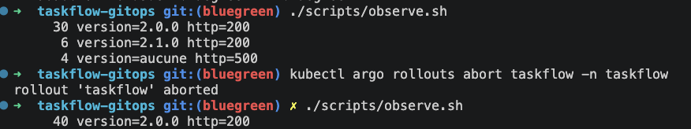

Le script confirme que le service répond désormais avec `version=2.0.0` et des codes HTTP `200`, ce qui valide la fin du canary à la suite de l'abort. La version 2.1.0 ne fonctionnant pas.

### Blue-Green ou Canary pour TaskFlow ?

Pour un service comme TaskFlow, le meilleur choix dépend du niveau de risque acceptable.

- Le Blue-Green est plus simple à comprendre et à maintenir : un service actif et un service de prévisualisation, avec un basculement net et un rollback rapide. Le coût est faible, mais le risque est plus visible si la version cible est défaillante au moment du switch.
- Le Canary est plus coûteux en operational complexity : il demande plus de surveillance, plus de contrôles de trafic et une validation plus fine. En revanche, il réduit le risque de dégradation globale parce que le trafic est réparti progressivement.

Pour une application de type petite API interne, le Blue-Green est souvent le choix le plus lisible et le plus rapide à exploiter. Pour un service plus critique ou plus sensible au risque de production, le Canary apporte un meilleur contrôle au prix d’une complexité plus élevée.

# LAB J3

## A. Étalon et analyse de robustesse

### Baseline 2.0.0 avec `charge.sh`

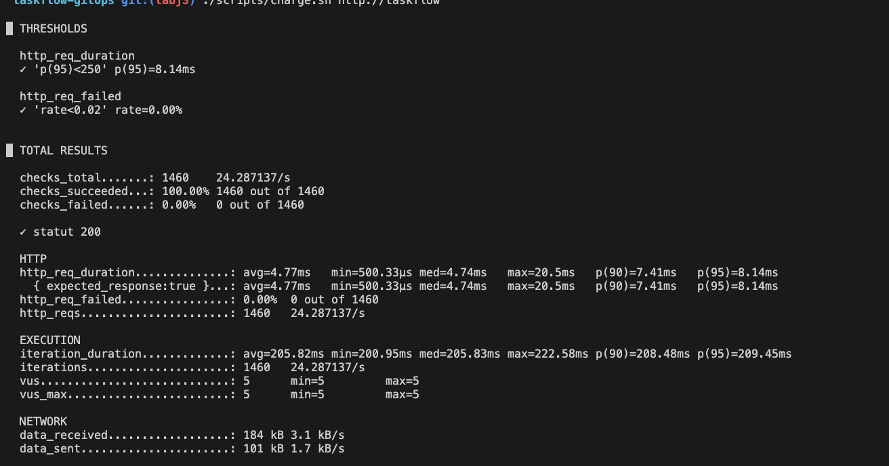

Avant d’introduire une révision problématique, nous avons mesuré la version stable `2.0.0` avec `./scripts/charge.sh http://taskflow`. La sortie est utilisée comme point de comparaison : on note les erreurs HTTP, le p95 et le niveau global de qualité de service. C’est la référence qui permettra de montrer qu’une révision suivante a dépassé le seuil acceptable.

### Ajout des fichiers de robustesse

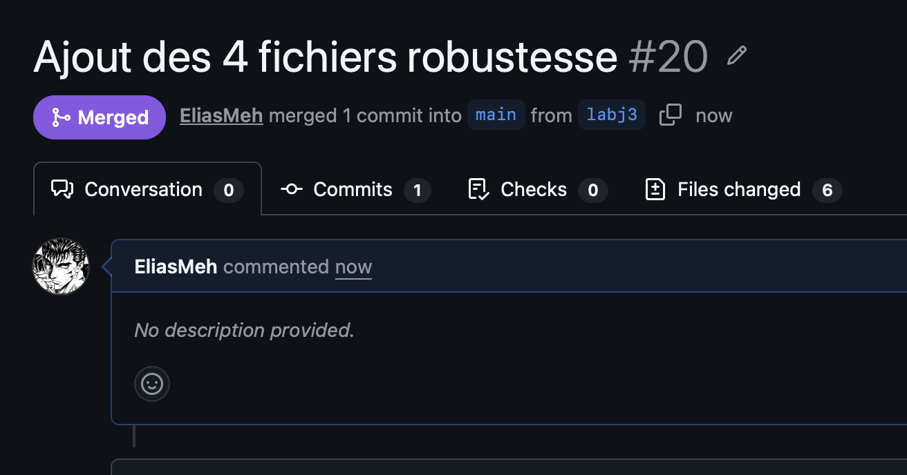

Le dossier `exemples/robustesse` apporte les composants nécessaires à l’analyse automatique : le `Rollout` dédié, les services, le `ConfigMap` de charge et les templates d’analyse. Ce mécanisme transforme le déploiement simple en un pipeline de validation qualité, avec décision automatique de promotion ou d’abort.

### Vérification des CRD et des ressources associées

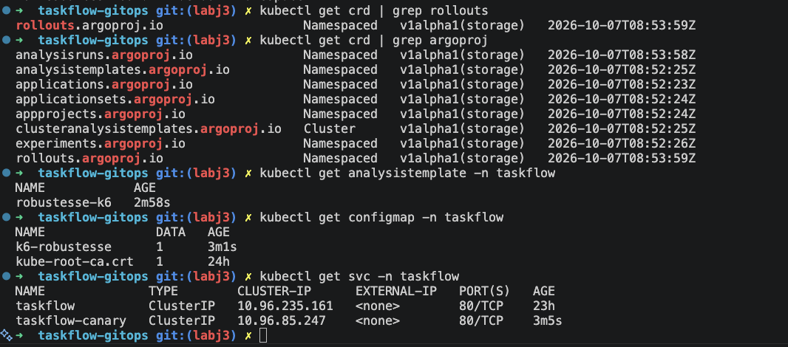

Le manifeste de l’application est désormais un `Rollout`, et non plus un `Deployment`. Avant de lancer l’incident, il faut vérifier que les ressources de Argo Rollouts sont bien présentes dans le cluster : la CRD, le `AnalysisTemplate`, le `ConfigMap` et le `Service`. Ce contrôle permet de confirmer que le mécanisme d’analyse et de promotion automatique est bien branché sur le cluster.

## B. L’incident 2.1.0 et les preuves — faux positif initial

### Attention : preuve du faux positif

Les captures ci-dessous correspondent à un faux positif initial. La cause n’était pas une régression réelle de la version, mais le fait que le selector n’avait pas encore été correctement propagé sur les nouveaux pods. Le système observait donc un état incomplet, ce qui a produit des signaux trompeurs sur le rollout et sur les checks k6. Ces captures doivent donc être interprétées comme une preuve du faux positif, et non comme une preuve d’un bug fonctionnel réel sur la version 2.1.0.

### Preuve 1 — faux positif : le pod post migration est en service et la version est active

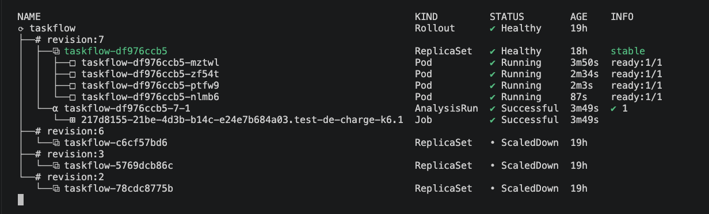

À ce stade, l’observation semblait indiquer que la nouvelle version était bien déployée et active. En réalité, la cible du test n’était pas encore bien alignée sur les nouveaux pods, donc cette image ne reflète pas un vrai échec fonctionnel de la version elle-même.

### Preuve 2 — faux positif : k6 signale des checks en échec

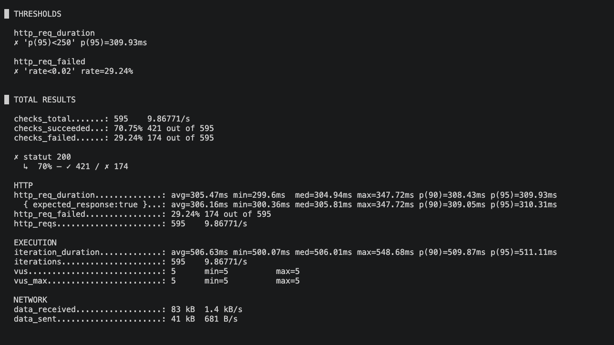

Le report k6 indiquait des checks en échec, mais cette alerte était liée à un mauvais ciblage du service lors de la validation, et non à une réelle défaillance de la version déployée. La lecture correcte est donc : “validation trompeuse”, pas “régression confirmée”.

### Preuve 3 — faux positif : `describe analysisrun` semble confirmer une validation automatique négative

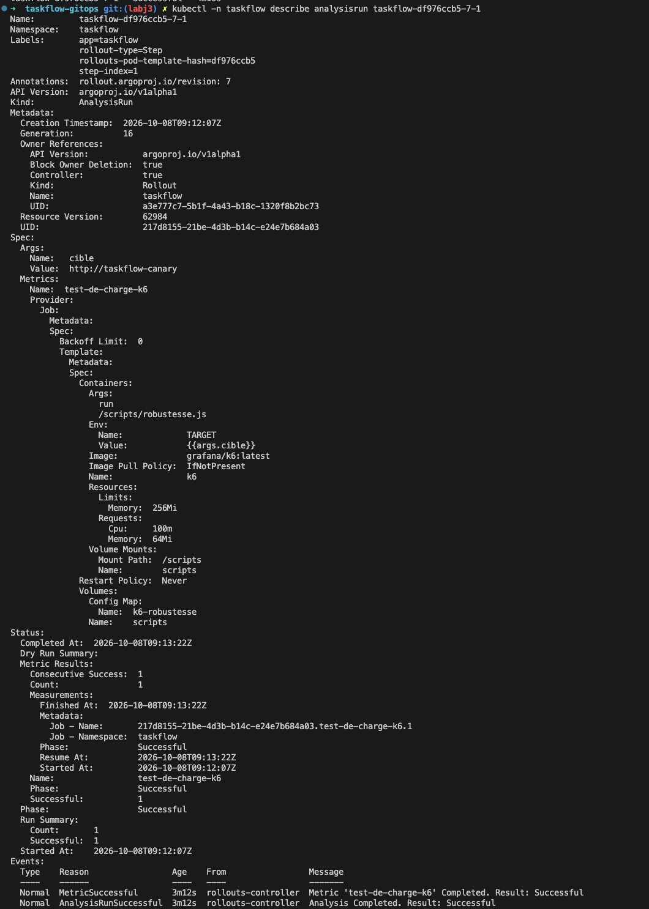

Le `describe analysisrun` montrait un état qui semblait négatif. En réalité, il a servi de preuve supplémentaire de l’erreur de ciblage : la commande pointait vers les mauvais pods, ce qui a faussé la lecture de l’analyse. Le mécanisme Argo Rollouts n’était pas encore observant la bonne cible.

### Preuve 4 — faux positif : chronologie et fin du rollout

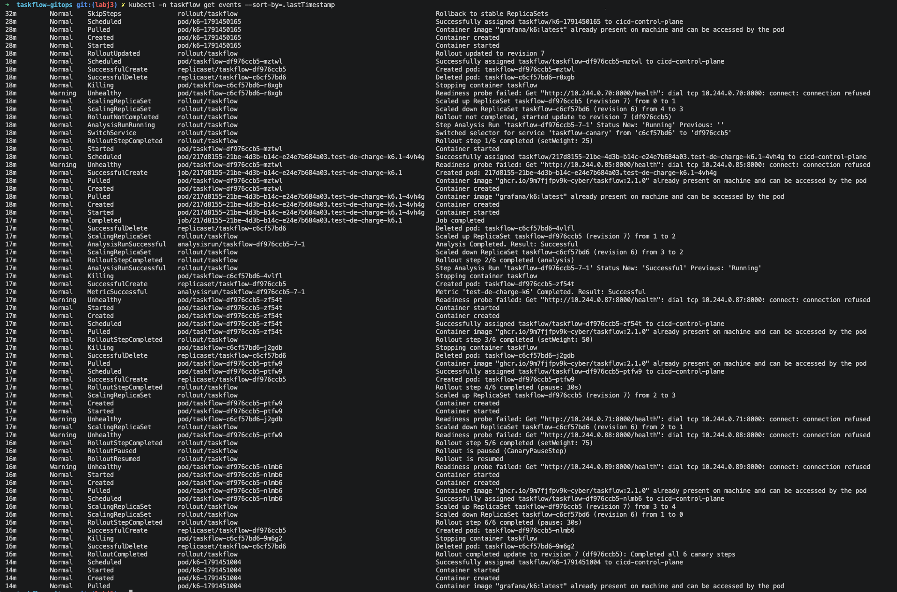

La chronologie faisait croire à un résultat de validation défavorable, mais elle ne reflétait pas le vrai état du service après correction du selector. La conclusion correcte est donc: ce n’était pas encore la bonne preuve de défaillance ; c’était un faux positif technique de ciblage.

## C. Post correction du faux positif

### Correction appliquée

Après avoir augmenté le temps d’attente et laissé le selector se propager sur les nouveaux pods, la validation a enfin ciblé la bonne cible. La phase d’abort a alors été observée correctement, et les captures suivantes reflètent le vrai comportement de l’application après correction du faux positif.

### Preuve 1 — post-abort : état observé après correction du selector

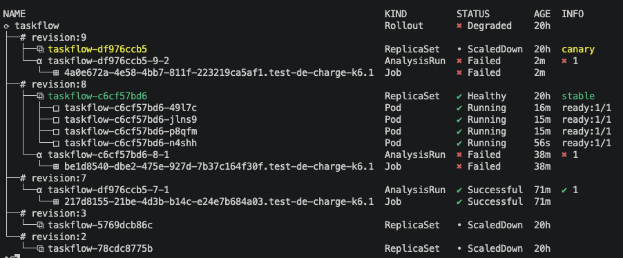

Cette capture montre l’état réel après correction du faux positif. Les pods ciblés sont bien les bons, et la validation ne se base plus sur des conteneurs non cohérents avec la révision active.

### Preuve 2 — post-abort : suivi de la progression du rollout

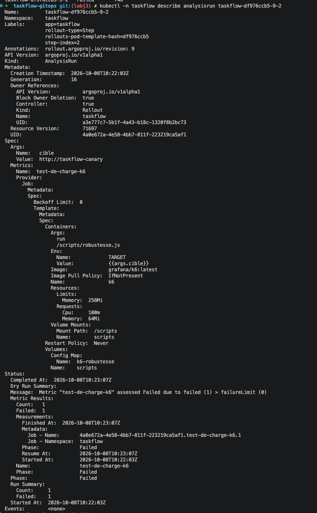

On observe le comportement de progression du rollout après correction du ciblage. Le système se comporte comme attendu : les étapes de validation et d’abort sont désormais cohérentes avec les ressources réellement concernées.

### Preuve 3 — post-abort : validation du comportement du service

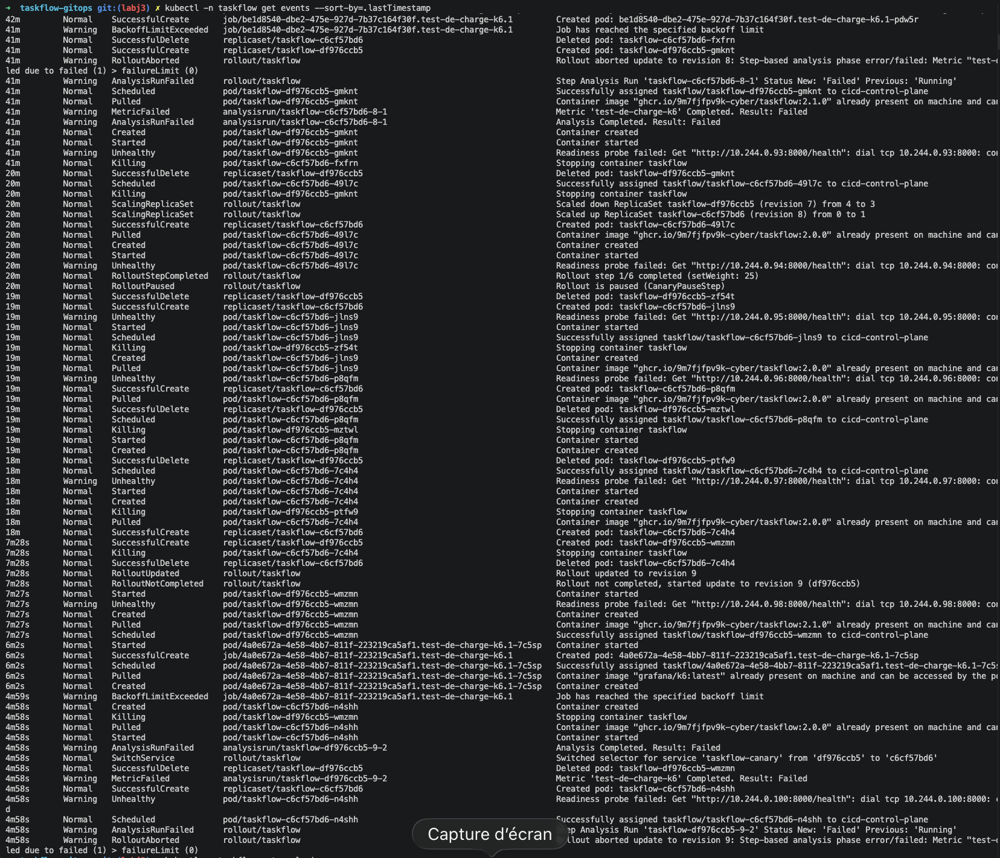

Cette capture confirme que le service est désormais observé correctement, avec la vraie logique de canary / analyse. Le faux positif a bien été éliminé et le système est revenu à un état de lecture fiable.

## D. Passage en 2.2.0 validé

### Passage réussi vers la version 2.2.0

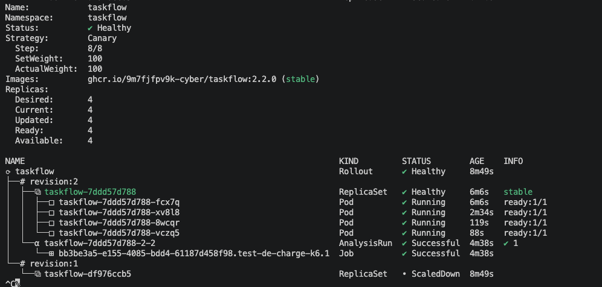

Une fois le faux positif corrigé, le passage vers la version `2.2.0` fonctionne correctement. La preuve finale montre que la nouvelle révision est bien active, stable et acceptable selon les seuils de robustesse. La délivrable est donc validée : le système passe bien de la version problématique à une version saine après correction du ciblage et de la validation.

### Création du post-mortem

Le fichier apps/taskflow/docs/postmortem-incident-2-1-0.md représente le résumé, la root cause et la correction de l'incident de déploiement.

# Lab C

## PSSI — règles obligatoires dans le pipeline

Les règles de sécurité ci-dessous sont contrôlées en PR et doivent être rendues obligatoires dans le ruleset GitHub (branch protection / required status checks).

| Règle | Contrôle | Outil | Preuve |
| --- | --- | --- | --- |
| PSSI-R1 | Tag explicite, jamais `latest` | `conftest` | Sortie `FAIL` si l'image n'a pas de tag explicite |
| PSSI-R2 | Registre autorisé `ghcr.io/9m7fjfpv9k-cyber/` | `conftest` | Sortie `FAIL` si l'image provient d'un autre registre |
| PSSI-R3 | Limite mémoire présente | `conftest` | Sortie `FAIL` si `resources.limits.memory` est absent |
| PSSI-R4 | `runAsNonRoot: true` | `conftest` | Sortie `FAIL` si le pod n'est pas non-root |
| PSSI-R5 | Aucune vulnérabilité HIGH/CRITICAL corrigeable | `Trivy` | Sortie de scan non nulle sur image vulnérable |

### Analyse des captures


#### 1. Mise en évidence du problème côté manifestes

Les premières captures montrent l'état initial du Rollout, avant le durcissement complet. On voit que le travail n'est pas encore conforme à la mini-PSSI, ce qui explique pourquoi le passage dans `conftest` sert de point de départ au diagnostic.

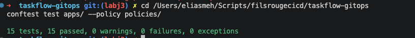

Quand `R3` et `R4` sont ajoutées, l'analyse devient plus précise: le manifeste est mieux couvert, mais une erreur de conformité reste visible. La capture suivante illustre justement le fait qu'ajouter des règles ne suffit pas si le pod reste incompatible avec les exigences de sécurité.

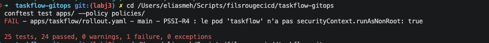

La correction apportée ensuite montre le bon réflexe: on part de l'erreur remontée par `conftest`, on corrige le Rollout, puis on relance le contrôle jusqu'à obtenir une validation propre.

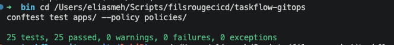

La solution retenue sur le Pod confirme le fond du correctif: l'objectif n'était pas seulement de faire passer le test, mais d'aligner le déploiement avec une posture de sécurité cohérente, en particulier sur l'exécution non-root.

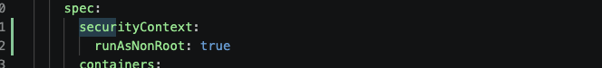

#### 2. Passage d'un correctif local à une règle de dépôt

Une fois le manifest corrigé, la suite logique consiste à empêcher la régression. La capture du ruleset montre que les deux checks critiques ont été déclarés obligatoires: `PSSI manifests (conftest)` et `PSSI images (Trivy)`.

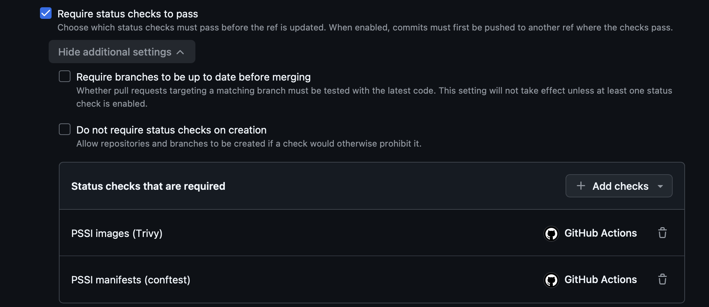

Cette étape est importante parce qu'elle transforme une bonne pratique locale en garde-fou de dépôt. Autrement dit, même si le manifest est correct à un instant donné, il ne peut plus être fusionné si l'un des contrôles de sécurité échoue.

#### 3. Traitement du blocage Trivy et gestion maîtrisée de l'exception

La capture suivante montre le cas problématique de l'image `2.2.0`: le push ou la mise à jour associée est bloquée parce que le scan remonte encore un risque de sécurité. Cela prouve que la politique ne se limite pas aux manifests Kubernetes; elle couvre aussi l'image réellement déployée.

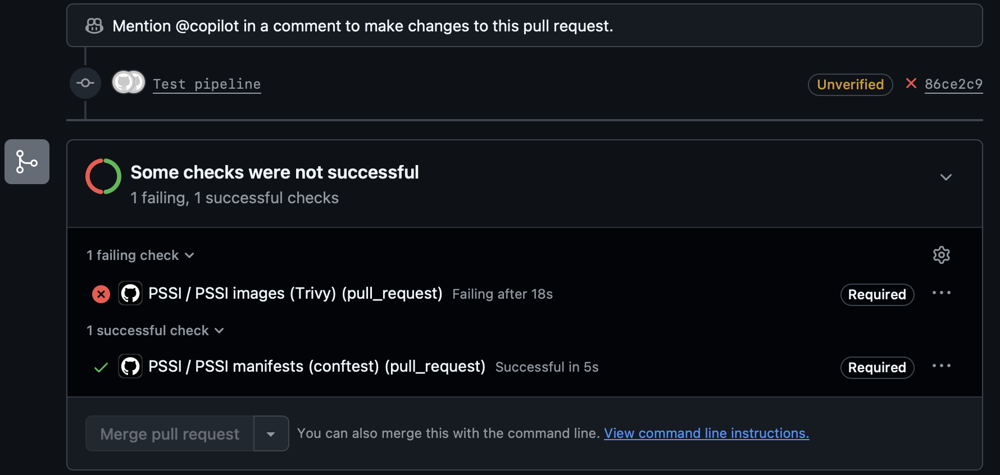

La sortie de scan montre ensuite la logique du blocage: Trivy détecte des vulnérabilités `HIGH` sur certaines dépendances Python, ce qui suffit à faire échouer le contrôle. Le signal est clair: tant que l'image embarque ces versions, le pipeline doit refuser la validation.

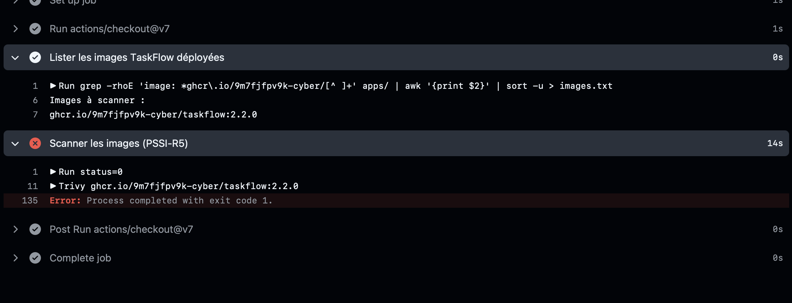

Après adaptation de la commande de lancement, la lecture des résultats devient plus exploitable. Cette étape sert surtout à stabiliser le mode d'exécution du scan pour obtenir une preuve lisible et reproductible.

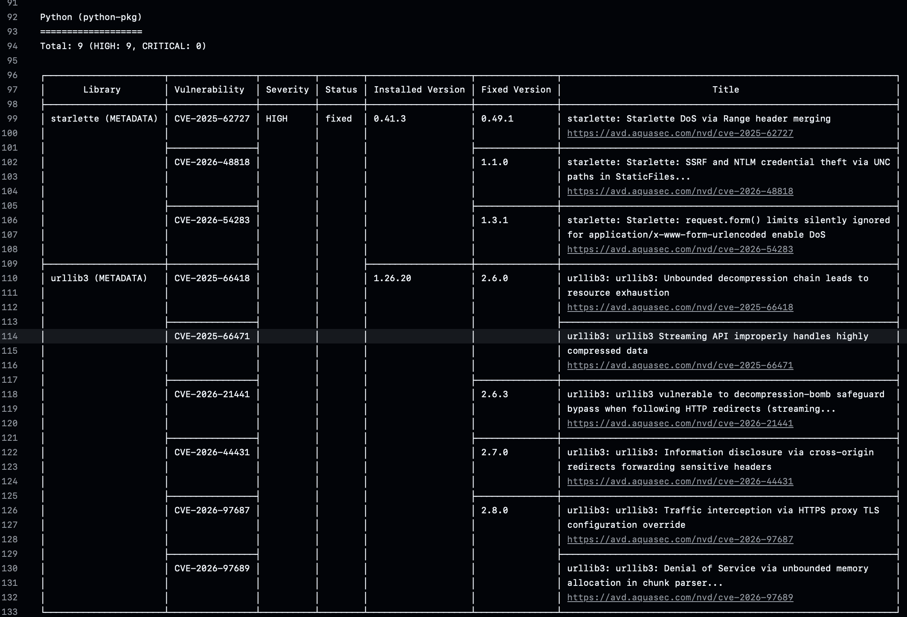

Une fois l'exception encadrée, les deux checks passent ensemble: le manifest est conforme et l'image n'est plus bloquante pour le pipeline. C'est la capture la plus importante du point de vue du livrable, parce qu'elle prouve que le dépôt est désormais protégé par les deux règles attendues.

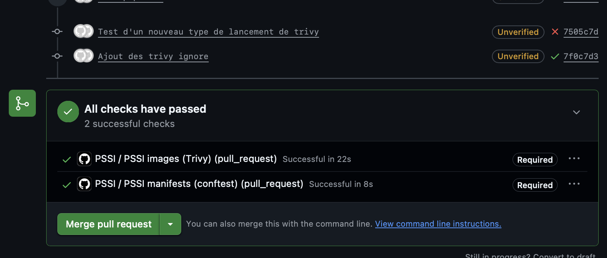

La dernière capture explique le résultat obtenu: les identifiants CVE ont été ajoutés dans `.trivyignore`, ce qui documente explicitement l'exception et évite de masquer silencieusement le problème. Le comportement est donc volontaire et traçable, pas accidentel.

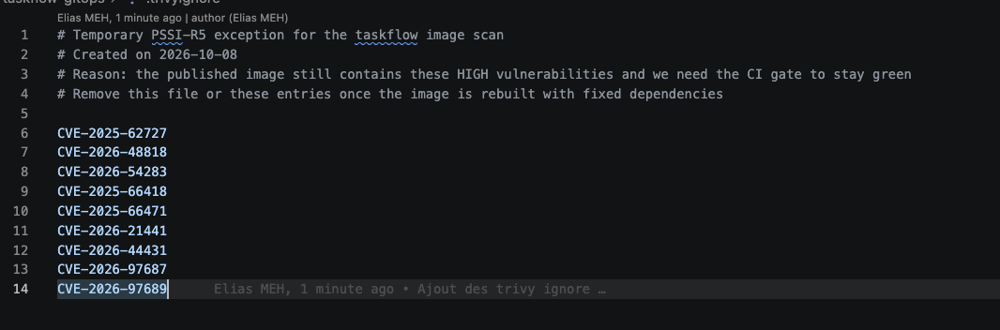

#### Synthèse

En résumé, les captures démontrent trois choses.

1. `conftest` sert à valider le manifeste Kubernetes et à faire apparaître immédiatement les écarts de sécurité comme l'absence de `runAsNonRoot: true`.
2. Le ruleset GitHub transforme ces contrôles en obligations de merge, ce qui empêche une PR non conforme de passer.
3. Trivy bloque les images qui contiennent encore des vulnérabilités corrigeables, et l'exception doit être explicitement encadrée dans `.trivyignore` quand on choisit de la tolérer temporairement.

### Preuve de blocage de PR : sortie locale sur une version non conforme

Lorsqu'un manifeste viole une règle, la PR est bloquée au niveau du check obligatoire. La preuve locale équivalente est la sortie suivante (obtenue lors du test de la version non conforme) :

```text
FAIL - apps/taskflow/rollout.yaml - main - PSSI-R4 : le pod 'taskflow' n'a pas securityContext.runAsNonRoot: true

25 tests, 24 passed, 0 warnings, 1 failure, 0 exceptions
```

C'est le même type de blocage que celui attendu dans GitHub quand le check `PSSI manifests (conftest)` ou `PSSI images (Trivy)` est rendu obligatoire dans le ruleset.

### Règle de traitement des vulnérabilités Trivy

Quand le scan Trivy remonte une vulnérabilité HIGH ou CRITICAL corrigeable :

- soit la vulnérabilité est corrigée dans l'image ;
- soit une exception datée et justifiée est ajoutée dans le fichier `.trivyignore`.

Exemple de format attendu :

```text
# Exception temporaire pour PSSI-R5
# Date: 2026-10-08
# Raison: vulnérabilité non corrigée dans l'image de démonstration, à revoir au prochain cycle de build
# À retirer avant 2026-12-31
```

### Actions de mise en protection du dépôt

1. Copier le workflow de sécurité dans `.github/workflows/pssi.yml`.
2. Rendre obligatoire les checks GitHub :
   - `PSSI manifests (conftest)`
   - `PSSI images (Trivy)`
3. Dans les settings de dépôt, configurer le branch protection sur `main` pour bloquer les merges tant que ces checks sont rouge.
4. En cas d'image non conforme (`latest`, `nginx`, registre non autorisé, ou vulnérabilité Trivy), la PR reste bloquée jusqu'à correction ou exception datée et validée.

### Vérification finale locale

La validation du manifest est maintenant conforme après correction du pod non-root :

```text
25 tests, 25 passed, 0 warnings, 0 failures, 0 exceptions
```


